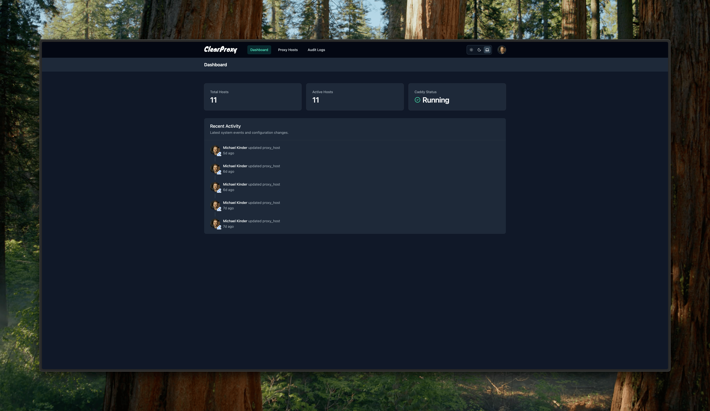

<p align="center">
  <picture>
    <source media="(prefers-color-scheme: dark)" srcset="screenshots/assets/logo-light.svg" width="400">
    <source media="(prefers-color-scheme: light)" srcset="screenshots/assets/logo-dark.svg" width="400">
    
  </picture>
</p>

# ClearProxy

[](https://github.com/FoggyMtnDrifter/ClearProxy/actions/workflows/docker-publish.yml)
[](https://github.com/FoggyMtnDrifter/ClearProxy/actions/workflows/eslint.yml)

> ⚠️ **Development Status**: ClearProxy is currently in beta stage and under active development. While it's not yet recommended for production environments, we strongly encourage you to test it and report any bugs or issues you encounter. Your feedback is invaluable as we improve stability and prepare for a production-ready release.

A modern, web-based management interface for [Caddy](https://caddyserver.com/), focusing on reverse proxy configuration with automatic HTTPS.

## Features

- 🌐 Easy management of proxy hosts
- 🔒 Automatic HTTPS via Caddy's built-in ACME client
- 🔐 Basic authentication support for proxied hosts
- ⚡ Modern, responsive UI built with SvelteKit
- 🛠️ Advanced configuration support with raw Caddyfile syntax
- 📊 Access logging and monitoring
- 🔄 Automatic database migrations


_ClearProxy Dashboard - Dark Mode_

## Documentation

Comprehensive documentation is available in the [docs](./docs) folder:

- [Getting Started](./docs/getting-started.md) - Installation and initial setup
- [User Guide](./docs/user-guide.md) - Comprehensive guide to using ClearProxy
- [Proxy Hosts](./docs/proxy-hosts.md) - Managing proxy hosts and domains
- [Authentication](./docs/authentication.md) - Setting up authentication for proxied hosts
- [Advanced Configuration](./docs/advanced-configuration.md) - Custom configurations for advanced features
- [Troubleshooting](./docs/troubleshooting.md) - Common issues and solutions
- [FAQ](./docs/faq.md) - Frequently asked questions

## Quick Start

### Using Docker (Recommended)

1. Create a new directory and download the docker-compose.yml:

```bash
mkdir clearproxy && cd clearproxy
curl -L https://raw.githubusercontent.com/foggymtndrifter/clearproxy/main/docker-compose.yml -o docker-compose.yml
```

2. Create required directories and configuration:

```bash
mkdir -p data/caddy/data data/caddy/config/caddy data/certificates

cat > data/caddy/config/caddy/caddy.json << 'EOF'
{
  "admin": {
    "listen": "0.0.0.0:2019",
    "enforce_origin": false,
    "origins": ["*"]
  },
  "apps": {
    "http": {
      "servers": {
        "srv0": {
          "listen": [":80"],
          "routes": []
        }
      }
    }
  }
}
EOF
```

3. Create or modify docker-compose.yml:

```yaml
version: '3.8'

services:
  app:
    image: ghcr.io/${GITHUB_REPOSITORY:-foggymtndrifter/clearproxy}:latest
    container_name: clearproxy-app
    restart: unless-stopped
    ports:
      - '3000:3000'
    environment:
      - NODE_ENV=production
      - DATABASE_URL=file:/data/clearproxy.db
      - CADDY_API_URL=http://caddy:2019
    volumes:
      - ./data:/data
    networks:
      - proxy-network
    depends_on:
      - caddy

  caddy:
    image: caddy:2-alpine
    container_name: clearproxy-caddy
    restart: unless-stopped
    command: caddy run --config /config/caddy/caddy.json
    environment:
      - CADDY_ADMIN_LISTEN=0.0.0.0:2019 # Required for admin API access
    security_opt:
      - no-new-privileges:true
    ports:
      - '80:80'
      - '443:443'
      - '2019:2019' # Admin API port (can be changed, e.g., "3019:2019")
    volumes:
      - ./data/caddy/data:/data
      - ./data/caddy/config:/config
      - ./data/certificates:/certificates
    networks:
      - proxy-network

networks:
  proxy-network:
    name: proxy-network
    driver: bridge
```

4. Start the application:

```bash
docker compose up -d
```

The application will be available at `http://localhost:3000`.

### Local Development

See [CONTRIBUTING.md](CONTRIBUTING.md) for detailed setup instructions.

### Configuration

The application uses SQLite for data storage and communicates with Caddy's admin API.

#### Environment Variables

- `CADDY_API_URL`: URL of Caddy's admin API (default: `http://localhost:2019`)
- `DATABASE_PATH`: Path to SQLite database file (default: `./clearproxy.db`)
- `LOG_LEVEL`: Logging level (default: `info`)

### Docker Architecture

The setup includes two containers:

1. **ClearProxy App** (`clearproxy-app`):

   - SvelteKit application
   - Business logic and UI
   - SQLite database management

2. **Caddy Server** (`clearproxy-caddy`):
   - Proxy operations
   - SSL/TLS certificate management
   - Admin API

### Updating

To update to the latest version:

```bash
# Using Docker Compose
docker compose pull
docker compose up -d
```

### Troubleshooting

If you encounter issues:

1. Check the logs:

```bash
docker compose logs app
docker compose logs caddy
```

2. Common issues:
   - Verify Caddy JSON configuration exists and is correct
   - Ensure required directories exist with proper permissions
   - Check Caddy admin API accessibility (port 2019)

For more detailed troubleshooting assistance, please see the [Troubleshooting Guide](./docs/troubleshooting.md).

## Community

- [GitHub Issues](https://github.com/foggymtndrifter/clearproxy/issues) - Bug reports and feature requests
- [GitHub Discussions](https://github.com/foggymtndrifter/clearproxy/discussions) - General questions and discussions
- Community chat (coming soon)

## Contributing

We welcome contributions! Please see [CONTRIBUTING.md](CONTRIBUTING.md) for guidelines.

## Support the Project

If you find ClearProxy useful, consider buying me a coffee to support ongoing development!

[](https://foggymtndrifter.com/contact/#/portal/support)

## License

This project is licensed under the MIT License - see the [LICENSE](LICENSE) file for details.
