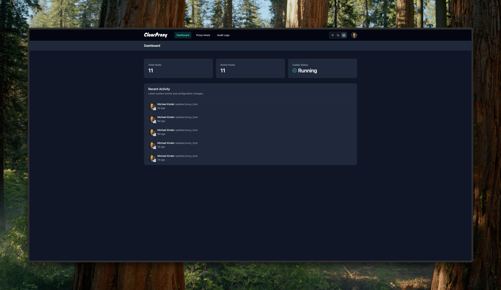

# ClearProxy User Guide

This comprehensive guide will help you navigate and make the most of ClearProxy's features. ClearProxy is a modern, web-based management interface for Caddy, focusing on reverse proxy configuration with automatic HTTPS.

## Table of Contents

1. [Dashboard](#dashboard)
2. [Proxy Hosts Management](#proxy-hosts-management)
3. [Audit Logs](#audit-logs)
4. [Authentication](#authentication)
5. [User Interface Navigation](#user-interface-navigation)

## Dashboard

The dashboard provides an overview of your ClearProxy system, including:

- **System Stats**: View the number of active proxy hosts and usage statistics
- **System Health**: Monitor the health of Caddy and related services
- **Latest Activity**: See recent activities and changes made to your configurations

### Dashboard Features


_Dashboard view in dark mode_

The dashboard provides valuable insights at a glance:

- **Active Proxy Hosts**: Total number of configured proxy hosts
- **Server Status**: Shows the status of your Caddy server
- **Recent Activity**: Displays recent configuration changes and actions
- **Resource Usage**: Monitors system resource utilization

## Proxy Hosts Management

[Detailed information available in the Proxy Hosts guide](./proxy-hosts.md)

Proxy hosts are the core feature of ClearProxy. They define how incoming requests to domains are proxied to backend services.

### Quick Tasks

- **Create a Proxy Host**: Click "Add Host" and fill in the domain and target details
- **Edit a Proxy Host**: Click the edit icon next to any proxy host in the list
- **Delete a Proxy Host**: Click the delete icon next to any proxy host in the list
- **Search Proxy Hosts**: Use the search box to filter the proxy hosts list

### Key Proxy Host Settings

- **Basic Configuration**:

  - Domain name: The public domain visitors will use
  - Target host: Internal hostname or IP where your service is running
  - Target port: Port your service is listening on
  - Target protocol: HTTP or HTTPS, depending on your service
  - Ignore Invalid Certificate: Skip SSL validation when using HTTPS targets

- **SSL/TLS Settings**:

  - SSL Enabled: Enable/disable SSL/TLS for this proxy host
  - Force SSL: Redirect HTTP traffic to HTTPS
  - HTTP/2 Support: Enable HTTP/2 protocol
  - HTTP/3 Support: Enable HTTP/3 protocol

- **Security Settings**:

  - Enable basic authentication with username and password
  - Requires users to authenticate before accessing the proxied service

- **Advanced Configuration**:
  - Add custom JSON configuration for advanced Caddy features
  - Examples include security headers, rate limiting, and path rewriting

## Audit Logs

The Audit Logs section helps you monitor activities and troubleshoot issues with your proxy configurations.

### Accessing Audit Logs

1. Click on **Audit Logs** in the sidebar menu
2. View the list of log entries showing actions and events

### Log Levels

- **INFO**: Normal operational messages
- **WARNING**: Issues that don't affect operations but may need attention
- **ERROR**: Problems that affect specific operations
- **CRITICAL**: Severe problems affecting system functionality

## Authentication

ClearProxy provides authentication both for the admin interface and for protected proxy hosts.

### Admin Interface Authentication

The admin interface is protected by authentication. When you first set up ClearProxy, you'll be prompted to create an admin account if no users exist in the database.

### Proxy Host Authentication

You can add HTTP Basic Authentication to any proxy host:

1. Edit the proxy host configuration
2. Enable the "Security" toggle
3. Enter a username and password
4. Click "Save" to apply

When basic authentication is enabled, visitors to your proxied service will see a browser authentication prompt and must enter valid credentials to access the service.

Security considerations:

- Basic Authentication sends credentials encoded (not encrypted) unless used with HTTPS
- ClearProxy automatically configures HTTPS when SSL is enabled
- Passwords are stored securely using bcrypt hashing
- Use strong, unique passwords for each proxy host

For more complex authentication scenarios, you can use the Advanced Configuration section to implement custom authentication schemes.

[More details in the Authentication guide](./authentication.md)

## User Interface Navigation

### Dark/Light Mode

ClearProxy supports both dark and light themes:

1. Click on your profile/settings menu in the top-right corner
2. Select "Dark Mode" or "Light Mode" to switch themes

### Responsive Design

The interface is fully responsive and works well on:

- Desktop computers
- Tablets
- Mobile devices

Simply resize your browser or access from any device for an optimized experience.

## Additional Features

### Advanced Configuration

For power users, ClearProxy allows adding custom JSON configuration to proxy hosts through the Advanced Configuration toggle:

```json
{
  "match": [
    {
      "path": ["/*"]
    }
  ],
  "handle": [
    {
      "handler": "headers",
      "response": {
        "set": {
          "Strict-Transport-Security": ["max-age=31536000; includeSubDomains; preload"],
          "X-Content-Type-Options": ["nosniff"],
          "X-Frame-Options": ["DENY"]
        }
      }
    }
  ]
}
```

See the [Advanced Configuration guide](./advanced-configuration.md) for more examples and detailed documentation.

### Configuration Backup & Restore

It's recommended to regularly back up your ClearProxy configuration:

1. The SQLite database file (`clearproxy.db`) contains your ClearProxy settings
2. Caddy's configuration and certificates are stored in the Caddy data directory
3. For Docker installations, back up the entire `data` directory

### System Requirements

ClearProxy is designed to be lightweight, but for optimal performance, we recommend:

- 1 CPU core
- 512MB RAM
- 1GB disk space
- Modern web browser
- Network connectivity between ClearProxy, Caddy, and your target services

### Updates

To update ClearProxy:

#### Docker Installation

```bash
# Pull the latest image
docker compose pull

# Restart the containers
docker compose up -d
```

#### Manual Installation

```bash
# Pull the latest code
git pull

# Install dependencies
npm install

# Rebuild and restart
npm run build
npm run start
```

## Next Steps

- [Proxy Hosts Guide](./proxy-hosts.md) - Detailed guide on proxy host management
- [Authentication Guide](./authentication.md) - How to secure your services
- [Advanced Configuration](./advanced-configuration.md) - Advanced Caddy configuration options
- [Troubleshooting](./troubleshooting.md) - Solutions to common issues
